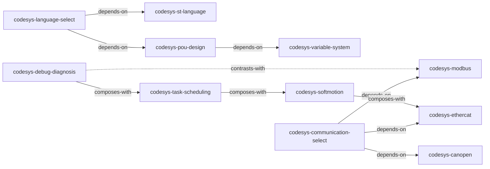

# INDEX.md — CODESYS 编程技能总览

> 基于《CODESYS 基础编程及应用指南》蒸馏，共产出 **11** 个 skills。
> 处理时间: 2026-07-27

## 关于本书

- **作者**: 陆国君
- **出版年**: 2015
- **一句话主旨**: 以 IEC 61131-3 国际标准为主线，系统讲解 CODESYS 开发环境下的 PLC 编程语言、指令系统、通信网络和工程实践。
- **整书理解**: [BOOK_OVERVIEW.md](./reference/BOOK_OVERVIEW.md)

---

## Skill 列表（按主题分组）

### ST 编程（4 个）

| Skill | 一句话描述 |
|-------|-----------|
| [codesys-language-select](codesys-language-select/SKILL.md) | 6 种 IEC 61131-3 语言的快速选型决策树 |
| [codesys-pou-design](codesys-pou-design/SKILL.md) | FUN/FB/PRG 三层架构设计原则与命名规范 |
| [codesys-variable-system](codesys-variable-system/SKILL.md) | 变量作用域、数据类型、匈牙利命名法、RETAIN/PERSISTENT |
| [codesys-st-language](codesys-st-language/SKILL.md) | ST 语法（IF/CASE/FOR/WHILE）与 6 种语言混合选型 |

### 工业通信（4 个）

| Skill | 一句话描述 |
|-------|-----------|
| [codesys-communication-select](codesys-communication-select/SKILL.md) | 5 种工业协议对比矩阵与选型原则 |
| [codesys-modbus](codesys-modbus/SKILL.md) | Modbus RTU/TCP 组态全流程与诊断 |
| [codesys-ethercat](codesys-ethercat/SKILL.md) | EtherCAT 主从站配置、DC 同步、PDO 映射 |
| [codesys-canopen](codesys-canopen/SKILL.md) | CANopen PDO/SDO、对象字典、EDS 配置 |

### 工程实践（3 个）

| Skill | 一句话描述 |
|-------|-----------|
| [codesys-softmotion](codesys-softmotion/SKILL.md) | SoftMotion 四层架构、PLCopen、CNC |
| [codesys-task-scheduling](codesys-task-scheduling/SKILL.md) | 任务类型、优先级、看门狗核心不等式 |
| [codesys-debug-diagnosis](codesys-debug-diagnosis/SKILL.md) | 五级调试体系、隐含检查函数、采样跟踪 |

---

## 引用图



图例:
- `-->` depends-on
- `-.->` contrasts-with
- `===>` composes-with

---

## 推荐学习顺序

1. **codesys-pou-design** — 最基础，理解 IEC 61131-3 的软件组织方式
2. **codesys-variable-system** — 掌握变量声明和数据类型
3. **codesys-language-select** — 理解何时用哪种语言
4. **codesys-st-language** — 学习最常用的 ST 语言语法
5. **codesys-task-scheduling** — 掌握任务实时性配置
6. **codesys-communication-select** — 了解通信协议选型
7. **codesys-modbus** → **codesys-ethercat** → **codesys-canopen** — 按需深入
8. **codesys-softmotion** — 运动控制扩展
9. **codesys-debug-diagnosis** — 调试技能兜底

---

## 安装

```bash
# 用户级（所有项目可用）
for d in codesys-*; do cp -r "$d" ~/.claude/skills/; done

# 或 npx 一键安装
npx skills add killernomber1/codesys-programming-skills
```
