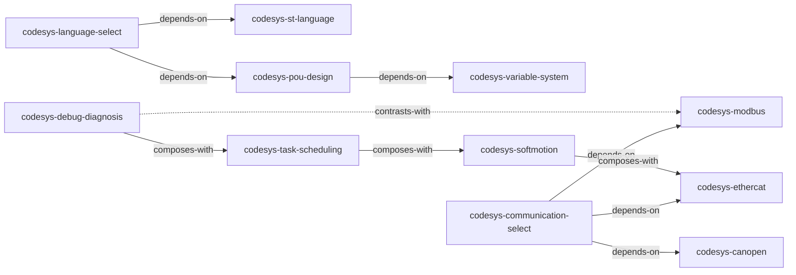

# CODESYS 编程技能包

> 基于《CODESYS 基础编程及应用指南》（陆国君，2015）蒸馏出的 11 个可调用 Agent Skills。

## 简介

本仓库从 425 页的《CODESYS 基础编程及应用指南》中，经过三重验证筛选和 RIA++ 结构化构造，提取出 11 个原子化的 Agent Skills，覆盖 CODESYS 编程的三大核心领域：

- **ST 编程** — POU 设计、变量声明、ST 语法、语言选型
- **工业通信** — Modbus RTU/TCP、EtherCAT、CANopen、协议选型
- **工程实践** — 任务调度、运动控制、调试诊断

每个 Skill 是一个遵循 Agent Skills 协议的 `SKILL.md` 文件，可在支持 SKILL.md 格式的 Agent 中直接调用。

## 快速安装

### 一键安装（跨 runtime）
```bash
npx skills add killernomber1/codesys-programming-skills
```

### 手动安装
将需要的技能目录复制到对应 runtime 的 skills 目录：

```bash
# Claude Code
cp -r codesys-pou-design ~/.claude/skills/

# Cursor
cp -r codesys-modbus ~/.cursor/skills/

# 或直接在本仓库中通过 agent 调用
```

## 技能总览

| 技能 | 分类 | 一句话描述 |
|------|------|-----------|
| [codesys-pou-design](codesys-pou-design/SKILL.md) | ST 编程 | FUN/FB/PRG 三层架构设计原则与命名规范 |
| [codesys-variable-system](codesys-variable-system/SKILL.md) | ST 编程 | 变量作用域、数据类型、匈牙利命名法、RETAIN/PERSISTENT |
| [codesys-st-language](codesys-st-language/SKILL.md) | ST 编程 | ST 语法（IF/CASE/FOR/WHILE）与 6 种语言混合选型 |
| [codesys-language-select](codesys-language-select/SKILL.md) | ST 编程 | ST/SFC/LD/FBD/CFC/IL 快速选型决策树 |
| [codesys-communication-select](codesys-communication-select/SKILL.md) | 通信 | 5 种工业协议对比矩阵与选型框架 |
| [codesys-modbus](codesys-modbus/SKILL.md) | 通信 | Modbus RTU/TCP 组态全流程与诊断 |
| [codesys-ethercat](codesys-ethercat/SKILL.md) | 通信 | EtherCAT 主从站配置、DC 同步、PDO 映射 |
| [codesys-canopen](codesys-canopen/SKILL.md) | 通信 | CANopen PDO/SDO、对象字典、EDS 配置 |
| [codesys-softmotion](codesys-softmotion/SKILL.md) | 工程 | SoftMotion 四层架构、PLCopen、CNC |
| [codesys-task-scheduling](codesys-task-scheduling/SKILL.md) | 工程 | 任务类型、优先级、看门狗核心不等式 |
| [codesys-debug-diagnosis](codesys-debug-diagnosis/SKILL.md) | 工程 | 五级调试体系、隐含检查函数、采样跟踪 |

## 技能间关系



## 来源

本 Skill 包基于《CODESYS 基础编程及应用指南》（陆国君，2015）使用 [cangjie-skill](https://github.com/alchaincyf/cangjie-skill) 蒸馏方法生成。

## 许可证

MIT
